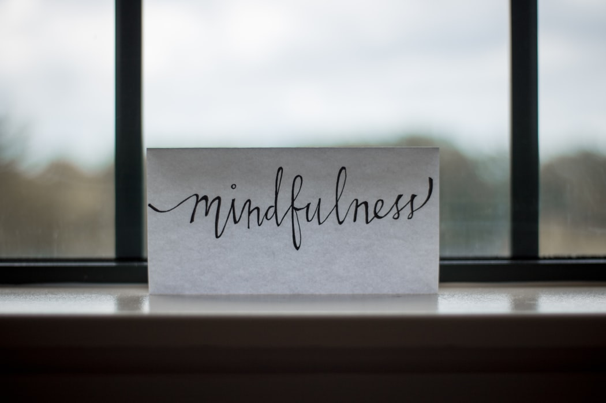
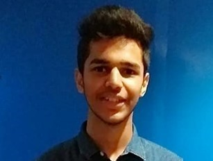
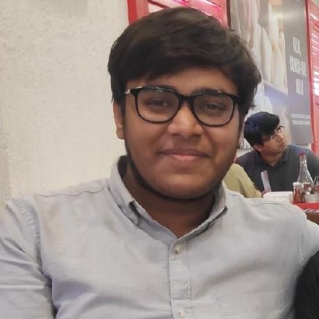
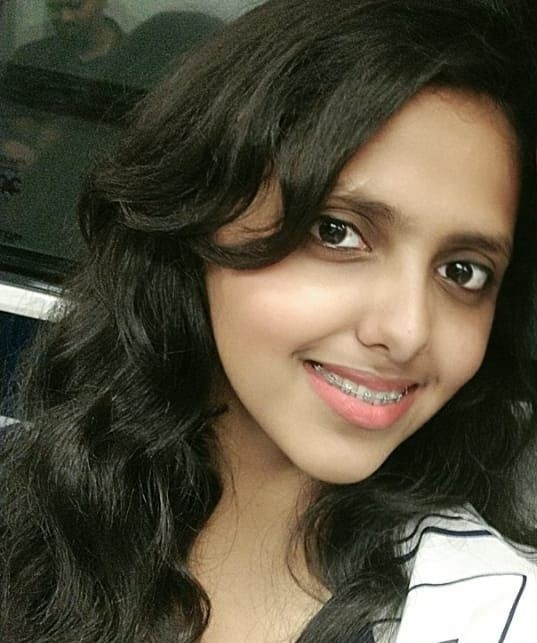
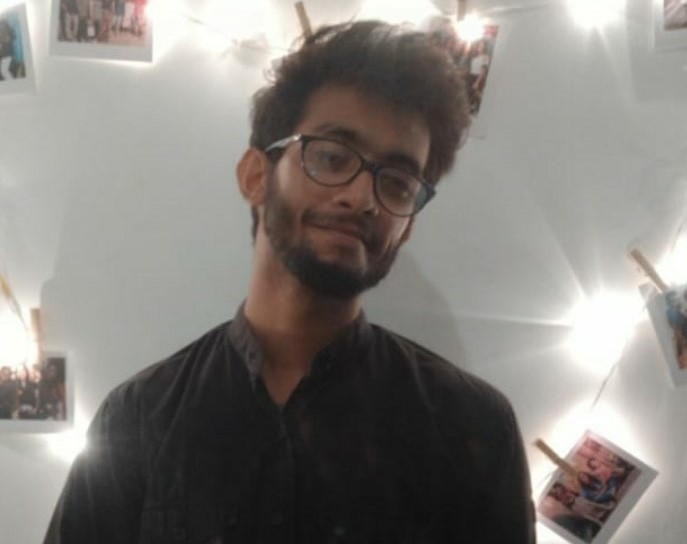
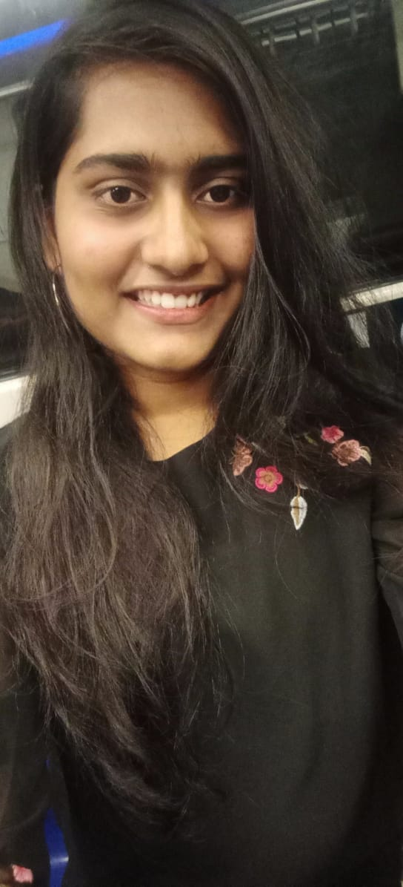

[![Contributors][contributors-shield]][contributors-url]
[![Forks][forks-shield]][forks-url]
[![Stargazers][stars-shield]][stars-url]
[![Issues][issues-shield]](https://github.com/aadimangla/PsyHealth-Open-Dil-Hackathon/issues)
[![MIT License][license-shield]][license-url]


<!-- PROJECT LOGO -->
<br />
<p align="center">
  <a href="">
    
  </a> 

  <h1 align="center">PsyHealth</h1>

  <p align="center">
    <!-- An awesome README template to jumpstart your projects! -->
    <br />
<!--     <a href=""><strong>Explore the docs »</strong></a> -->
    <br />
    <br />
    <!--<a href="">View Demo</a>
    ·
    <a href="">Report Bug</a>
    · -->
    <a href="https://github.com/aadimangla/PsyHealth-Open-Dil-Hackathon/issues">Request Feature</a>
  </p>
</p>

---

<!-- TABLE OF CONTENTS -->
## Table of Contents

* [About the Project](#about-the-project)
  * [Built With](#built-with)
* [Getting Started](#getting-started)
  * [Prerequisites](#prerequisites)
  * [How to Run](#how-to-run)
* [Contributors](#contributors)
* [License](#license)

---

<!-- ABOUT THE PROJECT -->
## About The Project

[![Product Name Screen Shot][product-screenshot]](images/product.png)

To the outside world, our lives may look perfect. But in reality, there is always a constant mental struggle, swarming thoughts keeping us awake all night. We are all on the continuum rather than being ill or well. Our genetic make-up, life circumstances affect our being. The aim of our team is to help people surpass these constrictions and move people up the ladder so that they can reach their full potential and lead productive lives. This is our website and why we believe strongly in our mission.As a patient or someone seeking help, we have you all covered.

We offer services like Booking an Appointment, Doctor-Patient Confidentiality, Interacting with our chatbot and Interactive Sessions.There is a simple form which you will have to fill which is not a time-consuming process at all and click book appointment. All necessary details will be emailed to you. Our highlights involve video calling which we facilitate to get in touch with the doctor within the comforts of your home. Let's explore the login options for the doctor.

The doctor can log in with their email id and password or signup in case they do not have an account. Upon successful login, the doctors can view their appointments. In case of any dilemma regarding consulting the doctors, we have you all covered. You can take help of our layered chatbot just answer simple questions to find out the need for consultation. We cover Anxiety and depression, Trauma, Drugs, Sleep, Eating and OCD. Once you answer these simple questions using our chatbot you will find out the urgency of your situation. We understand that the world is facing a global pandemic and times are tough. We believe that mind is our greatest asset. A healthy mind A healthy life.

---
### Built With
This project is build using following frameworks, libraries and softwares.
* [RASA](https://rasa.com/)
* [Spacy](https://spacy.io/)
* [Node.js](https://nodejs.org/en/)

---
## Project Demo


---
<!-- GETTING STARTED -->
## Getting Started

To run this project you need to follow the following steps.

### Prerequisites

These are the prerequisites you need to build this bot as well as run it.
* [Node.js](https://nodejs.org/en/)
* [RASA](https://rasa.com/)

### How to run
 
#### To run Web app
```sh
$ npm init
$ npm install
$ node app
```
#### To run Rasa Server
* Go to the ScreeningChatbot folder and open two terminals and run the following commands
* Terminal 1 
```sh
$ rasa run actions
```
* Terminal 2
```sh
$ rasa run -m models --enable-api --cors "*" --debug
```

---


<!-- CONTRIBUTING -->
## Contributors

| <a href="https://www.linkedin.com/in/adarshagarwal198" target="_blank">**Adarsh Agarwal**</a> | <a href="https://www.linkedin.com/in/aadimangla/" target="_blank">**Aditya Mangla**</a> | <a href="https://www.linkedin.com/in/krettika-varshney/" target="_blank">**Krettika Varshney**</a> |
| :---: |:---:| :---:|
|[](https://github.com/AdarshAgrwal )| [](https://github.com/aadimangla)|[](https://github.com/Krettika)|
| <a href="https://www.linkedin.com/in/priyesh-sharan-b54490180" target="_blank">**Priyesh Sharan**</a> | <a href="https://www.linkedin.com/in/prachi-shrivastava/" target="_blank">**Prachi Shrivastava**</a> | <a href="https://www.linkedin.com/in/vivek-kumarsingh/" target="_blank">**Vivek Kumar Singh**</a> |
| [](https://github.com/Priyesh2000)    |  | [](https://github.com/fazenecture)  |


---


---
<!-- LICENSE -->


## License

[](http://badges.mit-license.org)

- **[MIT license](http://opensource.org/licenses/mit-license.php)**
- Copyright 2020


<!-- MARKDOWN LINKS & IMAGES -->
<!-- https://www.markdownguide.org/basic-syntax/#reference-style-links -->
[contributors-shield]: https://img.shields.io/github/contributors/aadimangla/PsyHealth-Open-Dil-Hackathon.svg?style=flat-square
[contributors-url]: https://github.com/aadimangla/PsyHealth-Open-Dil-Hackathon/graphs/contributors
[forks-shield]: https://img.shields.io/github/forks/aadimangla/PsyHealth-Open-Dil-Hackathon.svg?style=flat-square
[forks-url]: https://github.com/aadimangla/PsyHealth-Open-Dil-Hackathon/network/members
[stars-shield]: https://img.shields.io/github/stars/aadimangla/PsyHealth-Open-Dil-Hackathon.svg?style=flat-square
[stars-url]: https://github.com/aadimangla/PsyHealth-Open-Dil-Hackathon/stargazers
[issues-shield]: https://img.shields.io/github/issues/aadimangla/PsyHealth-Open-Dil-Hackathon.svg?style=flat-square
[issues-url]: https://github.com/aadimangla/PsyHealth-Open-Dil-Hackathon/issues
[license-shield]: https://img.shields.io/github/license/aadimangla/PsyHealth-Open-Dil-Hackathon.svg?style=flat-square
[license-url]: https://github.com/aadimangla/PsyHealth/blob/master/LICENSE.txt
[product-screenshot]: images/screenshot.png
